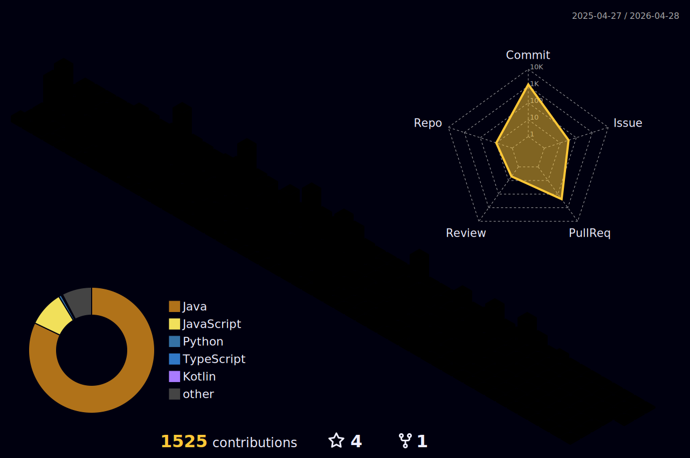

## 군남  👋

<!--
**GoToBILL/GoToBill** is a ✨ _special_ ✨ repository because its `README.md` (this file) appears on your GitHub profile.

Here are some ideas to get you started:

- 🔭 I’m currently working on ...
- 🌱 I’m currently learning ...
- 👯 I’m looking to collaborate on ...
- 🤔 I’m looking for help with ...
- 💬 Ask me about ...
- 📫 How to reach me: ...
- 😄 Pronouns: ...
- ⚡ Fun fact: ...
-->
<!--

  
-->

<table>
<tr>
  <td>

<b>🏃‍♀️ 활동 이력</b>  
 
| 기간 | 활동명 | 역할/포지션 |
|:--:|:--:|:--:|
|2025.04 ~ | SW 마에스트로 16기 | |
|2025.03 ~ | PROGRAPHY 10기 | 백엔드 |
|2024.03 ~ 2024.12| 멋쟁이사자처럼 12기 | 백엔드 |
|2023.08 ~ 2023.12| 42 SEOUL | |

<b>🏆 수상 내역</b>  

| 연도 | 수상명 | 주관기관 |
|:--:|:--:|:--:|
|2024| SW/AI 해커톤 대상 | 세종대학교 |
|2024| 컴퓨터공학과 학술제 우수상 | 세종대학교 |

  </td>
</tr>
</table>

<!-- -->
  

  <!-- 
  -->
  

<!---->

   
<h3 align="center">🔧Tech Stack🔧</h3>

  
  
  
  
  
  
  
  

 

  
  
  
  

